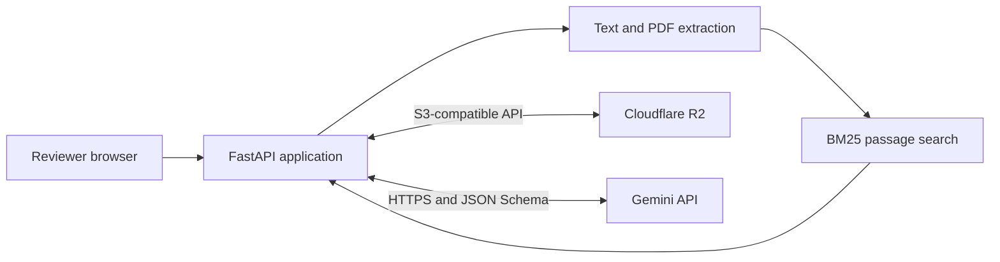

# Claim Evidence Verifier

Claim Evidence Verifier is a small review tool for checking whether a statement is supported by an original document. Upload a text file or text-based PDF, enter a claim, and the app will find the most relevant passages, ask Gemini for a verdict, and save the review so it can be opened again later.

It is meant to help a reviewer find and assess evidence more quickly. It does not replace the reviewer: the result always includes the source passages used, and the final decision stays with the person reading them.

## Try the live version

**Review workspace:** https://rounds-cinema-scope-remind.trycloudflare.com

This is a temporary Cloudflare Quick Tunnel running in front of the Docker container on the project owner's machine. Reviewers do not need their own R2 or Gemini credentials to use it. The link only remains available while the machine, container, and tunnel are running, and it may change if the tunnel is restarted.

The public deployment has been tested through a complete upload-to-review flow, including all three verdicts and reopening a saved result.

## How a review works

1. The reviewer uploads a UTF-8 `.txt` file or a PDF that already contains selectable text.
2. The app stores the original file in Cloudflare R2, extracts its text, splits it into stable passages, and stores that extracted copy beside the original.
3. A local BM25 search ranks the passages against the claim.
4. Gemini receives the claim and only the highest-ranking passages. It must return one of three results: `SUPPORTED`, `CONTRADICTED`, or `INSUFFICIENT_EVIDENCE`.
5. The backend checks every evidence ID returned by Gemini. It then fills in the quotation from the stored source rather than trusting model-written quote text.
6. The finished review is saved in R2 and returned with a URL that can be reopened later.

That last validation step matters. Gemini can choose from passages the application supplied, but it cannot introduce a new quotation and have it accepted as evidence.

## System layout



There is one application container. FastAPI handles the page, API, extraction, retrieval, validation, and orchestration. R2 and Gemini are independent managed services, which gives the project the real service-to-service integration required by the brief without inventing extra internal services.

R2 objects are stored under these keys:

```text
documents/doc_<uuid>/original.<ext>
documents/doc_<uuid>/extracted.json
reviews/rev_<uuid>.json
```

See [docs/architecture.md](docs/architecture.md) for the full request path.

## Run it locally

You will need:

- Docker Desktop with the Linux container engine running
- a Cloudflare R2 bucket and S3 API token
- a Google AI Studio Gemini API key

Both external services have free-tier options. Current pricing and terms are available on the [Cloudflare R2 pricing page](https://developers.cloudflare.com/r2/pricing/) and the [Gemini API pricing page](https://ai.google.dev/gemini-api/docs/pricing). Google's free tier may use submitted content to improve its products, so check the current data terms before uploading anything sensitive.

Copy the example environment file:

```powershell
Copy-Item .env.example .env
```

Open `.env` and replace the three `replace_me` values. Set `R2_ENDPOINT` with your Cloudflare account ID and change `R2_BUCKET` if your bucket has a different name. `.env` is ignored by Git and must never be committed.

Then start the whole project with one command:

```powershell
docker compose up --build
```

Once the health check passes, open http://localhost:8000. The repository includes `samples/sample_report.txt` and a suggested claim, so the first review can be run without preparing a document.

Press `Ctrl+C` to stop the foreground process. If Compose was started in the background, use `docker compose down`.

## Environment variables

| Variable | What it controls | Example or default |
| --- | --- | --- |
| `APP_ENV` | Runtime environment label | `development` |
| `LOG_LEVEL` | Application log level | `INFO` |
| `HOST` | Address Uvicorn binds to | `0.0.0.0` |
| `PORT` | Published application port | `8000` |
| `STORAGE_BACKEND` | Storage adapter; R2 is currently supported | `r2` |
| `R2_ENDPOINT` | Account-specific S3 endpoint | `https://<account-id>.r2.cloudflarestorage.com` |
| `R2_ACCESS_KEY_ID` | R2 API token access key | required |
| `R2_SECRET_ACCESS_KEY` | R2 API token secret | required |
| `R2_BUCKET` | Existing R2 bucket | `claim-verifier` |
| `VERIFIER_BACKEND` | Model adapter; Gemini is currently supported | `gemini` |
| `GEMINI_API_KEY` | Google AI Studio API key | required |
| `GEMINI_MODEL` | Gemini model name | `gemini-3.5-flash-lite` |
| `MAX_UPLOAD_MB` | Maximum upload size, from 1 to 50 MB | `10` |
| `REQUEST_TIMEOUT_SECONDS` | Timeout for an external request | `20` |
| `RETRIEVAL_TOP_K` | Number of passages sent to Gemini | `5` |
| `CHUNK_SIZE_CHARS` | Target passage length | `1200` |
| `CHUNK_OVERLAP_CHARS` | Overlap between adjacent passages | `200` |
| `MAX_DOCUMENT_PAGES` | Maximum number of PDF pages | `200` |
| `MAX_EXTRACTED_CHARS` | Maximum extracted document length | `500000` |
| `PUBLIC_BASE_URL` | Base URL shown to operators | `http://localhost:8000` |

`CHUNK_OVERLAP_CHARS` must be smaller than `CHUNK_SIZE_CHARS`.

## API

| Method | Endpoint | Use |
| --- | --- | --- |
| `GET` | `/health` | Basic health check; it does not call R2 or Gemini |
| `POST` | `/documents` | Validate, extract, chunk, and store a document |
| `POST` | `/reviews` | Find evidence, request a verdict, and save the review |
| `GET` | `/reviews/{review_id}` | Load a previously saved review |
| `GET` | `/docs` | OpenAPI documentation |

Example PowerShell requests are in [docs/api.md](docs/api.md).

## Tests and release checks

The normal test run does not need external credentials:

```powershell
uv sync --frozen
uv run pytest -q
```

The current offline result is **43 passed and 2 skipped**. The skipped tests are the live R2 and Gemini checks, which are opt-in so that routine CI runs cannot consume provider quota. With both integrations enabled, the full result is **45 passed**.

```powershell
$env:R2_INTEGRATION = '1'
uv run pytest -q tests/integration/test_r2.py

$env:GEMINI_INTEGRATION = '1'
uv run pytest -q tests/integration/test_gemini.py
```

The small checked-in retrieval corpus has five queries. All five rank the expected passage first. Over 1,000 local runs, median retrieval time was 0.1961 ms and p95 was 0.2181 ms. This is a regression check for the included sample data, not a claim about performance on every document.

CI also checks compilation, tests, repository history for secrets, the Compose configuration, a no-cache image build, image metadata and layers, container startup, and `/health`. Real-provider and public-deployment results are recorded in [docs/external-verification.md](docs/external-verification.md).

Additional local checks:

```powershell
uv run python scripts/security_audit.py
uv run python scripts/evaluate_retrieval.py --iterations 1000
uvx pip-audit -r requirements.lock
docker compose config --quiet
```

## Expected failure cases

Bad or oversized uploads return a clear 4xx response. Missing objects return 404. Missing provider configuration returns 503, and provider failures return a safe 502 or 504 depending on the problem. A malformed Gemini response or an evidence ID that was never supplied to the model is rejected and is not saved.

Application logs include request IDs, operation names, status codes, and timings. They do not include claims, document text, model responses, or credentials.

## Opening a temporary public tunnel

With the app running locally, install `cloudflared` and start the helper script:

```powershell
winget install --id Cloudflare.cloudflared --exact
.\scripts\start-tunnel.ps1 -Port 8000
```

Verify the URL printed by Cloudflare:

```powershell
uv run python scripts/verify_deployment.py https://your-tunnel.trycloudflare.com
```

A Quick Tunnel is suitable for a short review window, but not for unattended hosting. A named tunnel or container host is the better choice if the link needs to survive restarts. More detail is in [docs/deployment.md](docs/deployment.md).

## Known limits

The application does not currently include authentication, OCR, malware scanning, background jobs, a relational workflow database, or semantic/vector search. It accepts one bounded source document for each review flow. Scanned PDFs are rejected because they do not contain extractable text.

For production, I would add identity and tenant isolation first, followed by rate limits, malware scanning, retention controls, and a relational audit store. Large-document extraction should move to a background worker. I would only add semantic retrieval after testing it against a representative corpus and showing that BM25 is missing useful evidence.

## Notes and supporting documents

- [DESIGN.md](DESIGN.md) explains the main choices, rejected options, AI use, and open tradeoff.
- [BUILD_NOTES.md](BUILD_NOTES.md) records how the project was built and what changed during testing.
- [docs/verification.md](docs/verification.md) lists the release checks and their status.
- [docs/external-verification.md](docs/external-verification.md) records the real R2, Gemini, Docker, and public-flow tests.
- [docs/release-checklist.md](docs/release-checklist.md) is the final owner and reviewer checklist.
- [CHANGELOG.md](CHANGELOG.md) summarizes the release.

The project is licensed under the [GNU General Public License v3.0](LICENSE).
