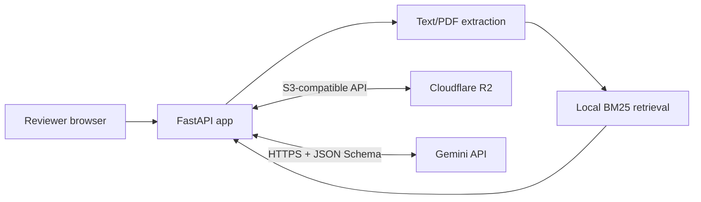

# Claim Evidence Verifier

Claim Evidence Verifier is a compact reviewer workspace for checking a written claim against an uploaded source. It retrieves the most relevant passages, asks Gemini for a constrained verdict, resolves every citation back to stored source text, and saves the review for later inspection. The result is decision support; a person remains responsible for the final judgment.

**Temporary review workspace:** https://rounds-cinema-scope-remind.trycloudflare.com

The URL above is an account-less Cloudflare Quick Tunnel. It is available only while the local app and tunnel process are running, may change after a restart, and has no uptime guarantee. The page and health endpoint have been checked publicly. A live upload-to-verdict run still needs the repository owner's R2 and Gemini credentials.

## What it does

1. Accepts a UTF-8 text file or text-bearing PDF, up to the configured size and page limits.
2. Stores the original and a page-aware extracted representation in Cloudflare R2.
3. Ranks stable text chunks locally with BM25.
4. Sends only the claim and top candidate passages to Gemini 3.5 Flash-Lite.
5. Accepts one of `SUPPORTED`, `CONTRADICTED`, or `INSUFFICIENT_EVIDENCE` through a strict JSON Schema.
6. Rejects citations that were not in the retrieved candidate set, then stores and displays the completed review.

## Architecture



FastAPI is the only application service. R2 holds immutable document and review artifacts; Gemini is called directly over HTTPS. Extraction, retrieval, storage, and verification sit behind small Python boundaries, which keeps the ordinary test suite deterministic and network-free.

Objects use this layout:

```text
documents/doc_<uuid>/original.<ext>
documents/doc_<uuid>/extracted.json
reviews/rev_<uuid>.json
```

[The architecture note](docs/architecture.md) follows the full request path.

## Prerequisites

- Docker Desktop with the Linux container engine running
- A Cloudflare R2 bucket and S3 API token
- A Google AI Studio Gemini API key

At the time of this release, [R2 Standard includes a monthly free tier](https://developers.cloudflare.com/r2/pricing/) and [Gemini 3.5 Flash-Lite has a free tier](https://ai.google.dev/gemini-api/docs/pricing). Provider terms and quotas can change, so check those pages before deploying. Google's free tier may use submitted content to improve its products; do not use sensitive source material without reviewing the current data terms.

## Configuration

Copy `.env.example` to `.env`, replace the three `replace_me` values, and put your R2 account ID in the endpoint. The file is ignored by Git. Do not paste credentials into issues, chat, source files, image build arguments, or command transcripts.

| Variable | Purpose | Example/default |
| --- | --- | --- |
| `APP_ENV` | Runtime mode | `development` |
| `LOG_LEVEL` | Application log threshold | `INFO` |
| `HOST` | Bind address | `0.0.0.0` |
| `PORT` | Published host port | `8000` |
| `STORAGE_BACKEND` | Storage implementation; currently R2 only | `r2` |
| `R2_ENDPOINT` | Account-specific S3 endpoint | `https://<account-id>.r2.cloudflarestorage.com` |
| `R2_ACCESS_KEY_ID` | R2 API token access key | required |
| `R2_SECRET_ACCESS_KEY` | R2 API token secret | required |
| `R2_BUCKET` | Existing bucket name | `claim-verifier` |
| `VERIFIER_BACKEND` | Verification implementation; currently Gemini only | `gemini` |
| `GEMINI_API_KEY` | Google AI Studio API key | required |
| `GEMINI_MODEL` | Model identifier | `gemini-3.5-flash-lite` |
| `MAX_UPLOAD_MB` | Upload limit, 1–50 MB | `10` |
| `REQUEST_TIMEOUT_SECONDS` | External request timeout | `20` |
| `RETRIEVAL_TOP_K` | Passages offered to the verifier | `5` |
| `CHUNK_SIZE_CHARS` | Target chunk length | `1200` |
| `CHUNK_OVERLAP_CHARS` | Overlap between chunks | `200` |
| `MAX_DOCUMENT_PAGES` | PDF page limit | `200` |
| `MAX_EXTRACTED_CHARS` | Extracted-text limit | `500000` |
| `PUBLIC_BASE_URL` | Canonical base URL for operators | `http://localhost:8000` |

`CHUNK_OVERLAP_CHARS` must be smaller than `CHUNK_SIZE_CHARS`.

## Start

The primary start command is:

```powershell
docker compose up --build
```

Open http://localhost:8000 after the `app` service becomes healthy. Upload `samples/sample_report.txt`, choose the suggested claim, run the review, and use the returned review link to confirm the saved result loads again.

Stop the stack with `Ctrl+C`, followed by `docker compose down` if it was started in the background.

## API

| Method | Path | Purpose |
| --- | --- | --- |
| `GET` | `/health` | Liveness check; does not spend provider quota |
| `POST` | `/documents` | Validate, extract, chunk, and store one document |
| `POST` | `/reviews` | Retrieve evidence, verify a claim, and persist the review |
| `GET` | `/reviews/{review_id}` | Return a saved review |
| `GET` | `/docs` | Interactive OpenAPI documentation |

PowerShell request and response examples are in [docs/api.md](docs/api.md).

## Verification

Install [uv](https://docs.astral.sh/uv/), then run the deterministic suite without external credentials:

```powershell
uv sync --frozen
uv run pytest -q
```

The credential-free release baseline is **43 passed and 2 skipped**. With the owner-provided integrations enabled, the complete suite is **45 passed**. The two opt-in tests are intentionally skipped in normal CI so a pull request cannot spend provider quota. Run them only after placing real values in your local `.env`:

```powershell
$env:R2_INTEGRATION = '1'
uv run pytest -q tests/integration/test_r2.py

$env:GEMINI_INTEGRATION = '1'
uv run pytest -q tests/integration/test_gemini.py
```

The checked-in five-query retrieval corpus scores 5/5 at top 1 and top 3. Across 1,000 local iterations, median retrieval time was 0.1961 ms and p95 was 0.2181 ms. These figures are a regression baseline for the small synthetic corpus, not a general accuracy or latency claim. The real-provider and public-flow evidence is recorded in [docs/external-verification.md](docs/external-verification.md).

CI compiles the source, runs the suite and secret scan, validates Compose, builds the image without cache, audits image metadata and layer history, and boots the resulting container through `/health`.

Useful local checks:

```powershell
uv run python scripts/security_audit.py
uv run python scripts/evaluate_retrieval.py --iterations 1000
uvx pip-audit -r requirements.lock
docker compose config --quiet
```

## Failure behavior

| Condition | Response |
| --- | --- |
| Empty, unsupported, oversized, or unreadable upload | Specific 4xx error; no partial extracted artifact is left behind |
| Missing document or review | Safe 404 response |
| R2 not configured | Safe 503 response |
| R2 unavailable | Safe 502 response |
| Gemini not configured | Safe 503 response |
| Gemini timeout | Safe 504 response |
| Malformed model output or invented evidence ID | Safe 502 response; review is not persisted |

Logs contain request IDs, operation names, status, and duration. They deliberately omit claims, document text, model responses, and credentials.

## Temporary deployment

With the application running, install `cloudflared` and open a tunnel:

```powershell
winget install --id Cloudflare.cloudflared --exact
.\scripts\start-tunnel.ps1 -Port 8000
```

Check the printed URL with:

```powershell
uv run python scripts/verify_deployment.py https://your-tunnel.trycloudflare.com
```

For an unattended review window, use the same image with a named tunnel or container host and supply secrets at runtime. [docs/deployment.md](docs/deployment.md) covers the operational limits.

## Deliberate limits

This take-home slice has no authentication, OCR, asynchronous job queue, relational workflow database, semantic/vector retrieval, or webhook. It handles one bounded text document per review flow. Scanned PDFs fail cleanly because OCR is outside the scope.

The first production hardening work would be:

1. add authentication, authorization, rate limits, and tenant-scoped object keys;
2. add malware scanning, retention controls, and a relational audit/workflow store; and
3. move large-document extraction to background jobs, then evaluate hybrid lexical/semantic retrieval on a representative corpus.

## Development without Docker

```powershell
uv sync --frozen
uv run python -m app
```

The health endpoint and static workspace start without provider credentials. Upload and review routes correctly report configuration errors until R2 and Gemini are configured.

If Docker reports that it cannot connect to the engine, start Docker Desktop and wait for the Linux engine before retrying. If `cloudflared` was just installed but is not found, open a new terminal so the updated `PATH` is loaded.

## Project notes

- [DESIGN.md](DESIGN.md) — concise design rationale, cuts, and open tradeoff
- [BUILD_NOTES.md](BUILD_NOTES.md) — phase-by-phase evidence and AI assistance log
- [docs/verification.md](docs/verification.md) — release gates and their current status
- [docs/external-verification.md](docs/external-verification.md) — real R2, Gemini, Docker, and public-flow evidence
- [docs/release-checklist.md](docs/release-checklist.md) — reviewer and owner checklist
- [CHANGELOG.md](CHANGELOG.md) — release summary

Licensed under the [GNU General Public License v3.0](LICENSE).
