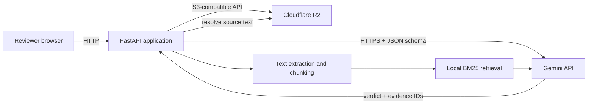

# Architecture

## System shape



FastAPI is the sole candidate-owned runtime. Cloudflare R2 and the Gemini API are independent external services. Extraction, retrieval, storage, and verification remain explicit modules with dependency-injected interfaces so automated tests are deterministic and network-free.

## Request flow

1. `POST /documents` validates and reads a bounded upload.
2. The application stores the original, extracts text in memory, creates stable chunks, and writes an `extracted.json` sidecar to R2.
3. `POST /reviews` loads that sidecar and retrieves the top lexical matches for the claim.
4. Gemini receives only the claim and labeled candidate passages and returns a schema-constrained verdict, reasoning, and evidence IDs.
5. The application rejects unknown IDs, resolves evidence text from its own candidate set, persists the review JSON, and returns it.
6. `GET /reviews/{review_id}` loads the same persisted artifact without relying on process memory.

## Object layout

```text
documents/doc_<uuid>/original.<ext>
documents/doc_<uuid>/extracted.json
reviews/rev_<uuid>.json
```

The local filesystem is not authoritative storage. Uploaded bytes are processed in memory within the configured bound.
